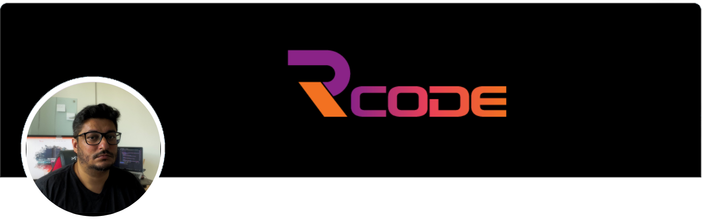

# Olá, eu sou o Roosevelt 👋

  
  
  
  
  

## 🚀 Sobre mim
Tenho 41 anos, moro no Rio de Janeiro e sou desenvolvedor front-end desde 2003 (Sobrevivi ao IE6 kkk). 

Nesses 20 anos de carreira eu tive diversas conquistas e desafios entre todos eu destaco os seguintes:

Mentoria de carreira para dezenas de desenvolvedores Juniores ou pessoas vindas de outra profissão para iniciar como desenvolvedor web. Hoje tenho orgulho de ver alguns já bem encaminhados na carreira.

Processo de transformação digital na ferramenta de pagamento da Herospark onde transformamos um script de pagamento simples em um carrinho de compras completo todo feito em SSR e com cobertura de testes completa. Reduzimos a quantidade de bugs de pagamentos para quase zero com um carrinho moderno, seguro e bem codificado.

Refatoração do sistema de abertura de sinistros auto e residencial na Bradesco Seguros. Trabalhei na transformação de templates jsf encapsulados em um sistema Java para duas soluções completas usando React e Vue consumindo API do Backend. Isso trouxe escalabilidade para os sistemas e além de melhorar a manutenção conseguimos uma economia em tráfego na Infra de mais de 40%.

Atuei por 6 anos na Telecom Rio Group onde evoluí de desenvolvedor pleno até a posição de Lead de front-end. Desenvolvemos dezenas de produtos internos, plataforma de pagamento e também fui o responsável pelo frontend do sistema de agendamento para o visto americano entre 2012 e 2015. Esse sistema no qual participei foi homologado pela embaixada e exportado para mais 2 países.

Desenvolvi na Spirit comunicação sites incríveis para Shell, Petrobrás, Tim, Terra, Shopping Rio Design, entre outros clientes. Tive uma evolução incrível na qualidade visual dos meus trabalhos graças ao período em que trabalhei lá.

Obrigado pela atenção para quem leu até aqui e fico à disposição para contato.

## 🚶🏽‍♂️ Trajetória Profissional

- 2003 - Comecei freelancer fazendo sites em Flash e HTML/CSS

- 2005 - Iniciei faculdade de Criação e Gestão de Ambientes Web

- 2006 - Meu primeiro estágio (só consertei impressora e fiz ☕)

- 2008 - Primeira vaga de Webdesigner Junior e Iniciação ao Javascript/JQuery

- 2009 - Terminei faculdade e fui trabalhar em pequenas agências de publicidade.

- 2010 - Mudei pra capital, virei fullstack pleno e troquei os sites de padaria do seu zé por sites para grandes marcas.

- 2011 - Voltei ao front-end e decidi me especializar em Javascript.

- 2012 - Entrei na Telecom Rio, empresa que permaneci por 6 anos. Entrei dev pleno e saí Tech Lead.

- 2012 - Trabalhei no sistema de agendamento do consulado americano. Sistema foi tão bem sucedido que além de homologado foi exportado como exemplo para mais 3 países.

- 2016 - Primeiro contato com Angular JS.

- 2018 - Primeiro contato com React e VueJS.

- 2019 - Implementação de transformação digital na Bradesco Seguros com modernização de linguagem, design system e rearquitetura.

- 2020 - Primeiro contato com Testes, CI/CD, AWS e pipelines de deploy. Implementação de transformação digital em plataforma de pagamentos com modernização do script, criação de carrinho de compras, testes automatizados e deploy automatizado.

- 2021 - Lider técnico em um processo de transformação degital em uma plataforma de comunicação com implementação de microsserviços, design system, escrita de testes e modernização de linguagem.

